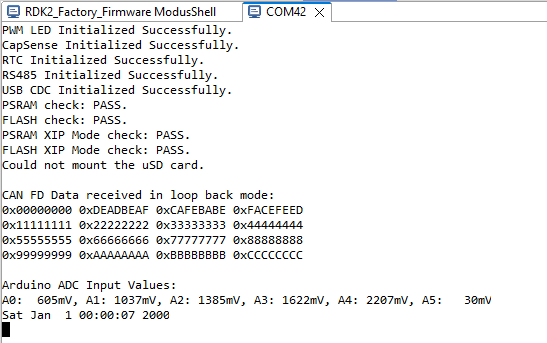

# RDK2 Factory Test Firmware

Rutronik Development Kit Programmable System-on-Chip CY8C6245AZI-S3D72 "Production" Firmware. 

This firmware example is preprogrammed in a factory and used to test most of the peripherals on board.

 

## Requirements

- [ModusToolbox® software](https://www.infineon.com/cms/en/design-support/tools/sdk/modustoolbox-software/) v3.0

### Using the code example with a ModusToolbox IDE:

1. Import the project: **File** > **Import...** > **General** > **Existing Projects into Workspace** > **Next**.
2. Select the directory where **"RDK2_Production"** resides and click  **Finish**.
3. Update libraries using  a **"Library Manager"** tool.
4. Select and build the project **Project ** > **Build Project**.
5. Program the compiled firmware.

### Operation

The firmware checks external PSRAM, Flash and micro SD Card memory. The debug information is available on KitProg3 UART port. 

 The RS485 and USB peripherals might be tested as they are echoing every symbol sent through the terminal. 

 The CAN FD is tested once in loop-back mode. 

The CapSense is initialized and operational after the tests are complete and can be tested manually as it controls the LED1 brightness. The CapSense Tuner is also available via KitProg3 I2C.

All the Arduino ADC inputs are shown as well.

The date and time shown in the terminal window will notify if the RTC peripheral is functional.

After the initial test is complete the LED1 will shine green and the brightness will depend on the CapSense slider position. If the test fails due to some peripheral faults, the LED2 stays on indefinitely.

### Debugging

If you successfully have imported the application, the debug configurations are already prepared to use with a the KitProg3, MiniProg4, or J-link. Open the ModusToolbox perspective and find the **Quick Panel**. Click on the desired debug launch configuration and wait until the programming completes and debug process starts.

## Legal Disclaimer

The evaluation board including the software is for testing purposes only and, because it has limited functions and limited resilience, is not suitable for permanent use under real conditions. If the evaluation board is nevertheless used under real conditions, this is done at one’s responsibility; any liability of Rutronik is insofar excluded. 

